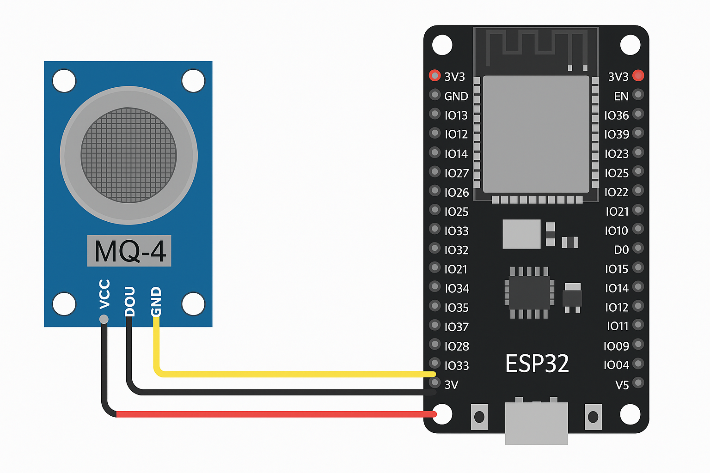

# 🧾 ESP32 MQ-4 Web Portal (No Login)

## 🔍 Overview
This project turns your **ESP32** into a self-contained **Wi-Fi hotspot (SoftAP)** that hosts a **live web dashboard** to monitor **MQ-4 gas sensor readings** — all without any external Wi-Fi network or login.

Once powered, the ESP32 creates a Wi-Fi network called **`ESP_MQ4_PORTAL`** (open, no password).  
You can connect from your phone or laptop and instantly see **live gas level readings** in real-time — including raw ADC, voltage, %, and approximate PPM values.

> ⚠️ **Note:** The PPM value is only a rough approximation for demonstration.  
> For accurate gas concentration, calibrate your MQ-4 sensor using its datasheet curves and load resistance (RL) values.

---

## ⚙️ Features
✅ Open Wi-Fi Access Point — no router or internet required  
✅ Web dashboard auto-refreshes every second  
✅ Displays:
- ADC value (0–4095)
- Sensor voltage (V)
- LPG concentration (%)
- Approx. PPM (uncalibrated placeholder)  
✅ Captive portal style — automatically redirects to dashboard  
✅ Lightweight and mobile-friendly UI  

---

## 🧰 Hardware Requirements
| Component | Quantity | Description |
|------------|-----------|-------------|
| ESP32 Development Board | 1 | Main microcontroller |
| MQ-4 Gas Sensor Module | 1 | Detects LPG / methane gas |
| Jumper Wires | as needed | For signal and power connections |
| Breadboard | 1 | (Optional) for easy wiring |

---

## 🔌 Wiring Connections

| MQ-4 Sensor Pin | Connects To (ESP32) | Description |
|------------------|---------------------|--------------|
| **VCC** | **5V** | Power supply to sensor module |
| **GND** | **GND** | Common ground |
| **AOUT** | **GPIO 34** | Analog signal input to ESP32 |
| **DOUT** | *(Not used)* | Digital output pin (optional threshold output) |

> ⚠️ **Important:**  
> MQ-4 analog output voltage must not exceed **3.3V**.  
> If your MQ-4 module outputs up to 5V, use a **voltage divider** (e.g., 10kΩ + 20kΩ) before connecting to GPIO 34.

---

## 🧩 Software Setup

### 1️⃣ Prerequisites
- **Arduino IDE** installed  
- **ESP32 board package** installed  
  *(File → Preferences → Additional Boards Manager URLs → add)*  
  ```
  https://dl.espressif.com/dl/package_esp32_index.json
  ```
- Select board:  
  **Tools → Board → ESP32 Dev Module**

---

### 2️⃣ Upload the Code

1. Copy the provided Arduino code into a new sketch.  
2. Select the correct **COM port**.  
3. Click **Upload**.

---

### 3️⃣ Run and Connect

1. After upload, open **Serial Monitor (115200 baud)**.  
2. ESP32 will print something like:
   ```
   Started AP: ESP_MQ4_PORTAL
   AP IP: 192.168.4.1
   HTTP server started.
   ```
3. On your phone or laptop:
   - Connect to Wi-Fi network **ESP_MQ4_PORTAL**
   - It’s open (no password)
   - If captive portal doesn’t auto-open, visit: **http://192.168.4.1**

---

## 📊 Web Dashboard Preview

| Display | Description |
|----------|--------------|
| **ADC** | Raw analog-to-digital reading (0–4095) |
| **Voltage** | Converted voltage (0–3.3V) |
| **Percent** | Scaled percentage of 3.3V range |
| **Approx PPM** | Rough estimation of LPG concentration (uncalibrated) |
| **Last Update Time** | Shows most recent sensor refresh |

Readings refresh automatically every 1 second.

---

## 🧮 Optional Calibration (Recommended)
For real PPM accuracy:
1. Measure **sensor resistance (RS)** in clean air.  
2. Compute **Ro** (reference resistance).  
3. Use MQ-4 datasheet’s **log-log graph** to derive:
   ```
   ppm = a * (Rs/Ro)^b
   ```
   where `a` and `b` are constants derived from calibration curves.

You can update this logic inside the `approxPPM()` function.

---

## 🧱 Project Structure

```
ESP32_MQ4_PORTAL/
│
├── esp32_mq4_portal.ino       # Main code (SoftAP + dashboard)
├── README.md                  # This documentation
```

---

## 📷 Wiring Diagram



---

## 🚀 Future Enhancements
- Add live graphing (Chart.js)
- Log data to SD card or SPIFFS
- Add DHT11 / Flame sensor readings
- Secure Wi-Fi with password

---

## 👨‍💻 Author
**T Rohan Kini**  
B.Tech Computer Science & Engineering, NMAMIT  
ESP32 | Embedded Systems | IoT | React Native | Robotics
